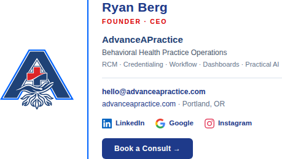

# Email brand assets

Logo and icons for outbound AdvanceAPractice email, plus the rules that keep them rendering.



## What broke

The Gmail signature referenced all four of its images as base64 `data:` URIs:

```html

```

**Gmail, Outlook (desktop), Outlook.com and Yahoo all refuse to render `data:` URIs in
received mail.** They are stripped before display. Apple Mail is the exception that renders
them, which is why a signature can look correct to the person who built it and be blank for
almost every recipient.

Because all four images used the same delivery method, they failed together — the logo *and*
every icon at once.

This was a regression. The signature sent on 2026-09-10 used ordinary hosted URLs
(`https://advanceapractice.com/wp-content/uploads/2026/05/aap-logo-transparent-2026.png`,
plus a hotlinked `img.icons8.com` icon). The version sent from 2026-09-19 had been rebuilt
with everything inlined as base64.

A second cost: inlining pushed the signature HTML to ~65 KB. Gmail clips any message over
102 KB behind a "Message clipped — View entire message" link, so a couple of replies in one
thread were enough to truncate real content. The rebuilt signature is ~7 KB.

## The fix

`signature-ryan-berg.html` is the same design with the four images referenced by absolute
`https://` URL instead. The PNGs in `brand/` were recovered from the sent mail, so they are
the exact artwork already in use — nothing was redrawn.

| File | Intrinsic | Displayed |
|---|---|---|
| `brand/aap-logo-240.png` | 240 × 196 | 120 × 98 |
| `brand/aap-icon-linkedin-32.png` | 32 × 32 | 16 × 16 |
| `brand/aap-icon-google-32.png` | 32 × 32 | 16 × 16 |
| `brand/aap-icon-instagram-32.png` | 32 × 32 | 16 × 16 |

All four are 2× the displayed size so they stay sharp on retina screens.

### Where the images are served from

The signature points at this repository, at a pinned commit:

```
https://raw.githubusercontent.com/advanceapractice/website/70ea4006.../email/brand/
```

This needs no upload and no hosting setup. The repository is public, so Gmail's image proxy
can fetch the files unauthenticated, and pinning to a commit SHA rather than a branch means
the URLs keep working even after the branch is deleted — GitHub keeps a pull request's head
commit reachable permanently.

Verified from here: each URL returns `200` with `content-type: image/png`, and all four load
and decode at their intended dimensions when the signature is rendered in Chromium.

**Moving them onto advanceapractice.com later** is a single find-and-replace. Upload the files
in `brand/` to the WordPress media library, then swap the prefix above for
`https://advanceapractice.com/wp-content/uploads/2026/09/`, keeping the filenames identical.
Open each new URL in a logged-out window before switching over. WordPress appends `-1`, `-2` …
to a filename that is already taken; if it does, match the `src` to what it actually saved.
Worth doing eventually — your own domain is the better permanent home for brand assets, and
`raw.githubusercontent.com` is not intended as a production CDN — but nothing is broken until
then.

### Installing it in Gmail

1. Gmail → Settings → See all settings → General → Signature.
2. Select the whole existing signature and delete it.
3. Paste the new one and click **Save Changes**.
4. Send a test to a non-Apple client — a Gmail address and an Outlook address — and confirm the
   logo and all three icons appear.

Paste the *rendered* signature, not the file's source text. Pasting HTML source into the Gmail
box makes Gmail escape it and display the markup as visible text.

## Rules for any AdvanceAPractice email

These apply to the signature and to templates the Command Suite sends.

- **Absolute `https://` URLs for every image.** Never `data:` URIs. Never relative paths —
  an email has no base URL to resolve them against.
- **No SVG.** Gmail and Outlook do not render it. PNG only.
- **No icon fonts** (Font Awesome, Material Icons) and no CSS `background-image` for anything
  that must be seen — `@font-face` and external stylesheets are stripped, and Outlook ignores
  background images.
- **Host the assets yourself.** The old signature hotlinked `img.icons8.com`; a third party
  can rate-limit or move a file and break your branding with no warning.
- **Serve images publicly and unauthenticated.** Gmail fetches through its own proxy
  (`googleusercontent.com`), signed in as nobody. Anything behind a login or an expiring
  signed URL returns an error to that proxy.
- **Set `width`, `height`, `display:block` and `border:0` on every ``**, and lay out with
  `<table>` and inline styles. Outlook renders through Word, not a browser engine.
- **Write for images-off.** Outlook blocks remote images until the reader clicks *Download
  pictures*, and there is no way around that. Give the logo `alt` text styled in brand colors
  so it degrades to something legible; give decorative icons empty `alt=""` so they vanish
  cleanly rather than leaving broken-image boxes, and keep a real text label beside them.
  `preview-signature.png` shows the images-on result; both states were rendered and checked.
- **Keep the whole message under 102 KB** or Gmail clips it.

## Still outstanding: Command Suite templates

The signature is only half the picture. The emails the Command Suite itself sends contain no
images at all — not a broken reference, simply no `` and no branding:

- **Client-facing**, e.g. *"Friday credentialing status — …"*: bare `<p>` tags. No logo, no
  header, no footer. A paying client receives an unbranded wall of text.
- **Operator-facing**, e.g. *"[AAP] New qualified lead (website chat)"*: same.
- **Operator lead alert**, *"[AAP Lead] …"*: well-built inline-styled tables, but still no
  logo and no icons.

Adding a branded header and footer to those templates needs the Command Suite repository,
which is not part of this one. The assets in `brand/` and the rules above are what those
templates should use.
